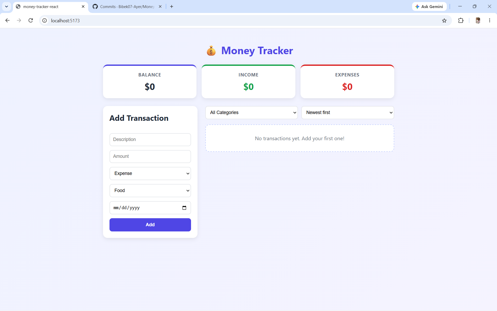
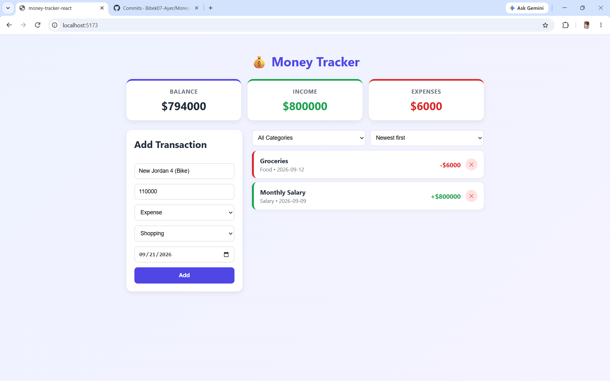
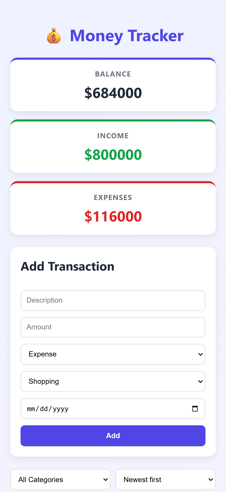

# 💰 Money Tracker

A simple personal expense tracker built with React. It lets you log income and expenses, see your running balance, and filter or sort your transactions. All data is saved in your browser, so it is still there after a page refresh.

**Live demo:** [View Live Website](https://money-tracker-react-indol.vercel.app/)

## Screenshots

| Desktop view | Adding a transaction | Mobile view |
|---|---|---|
|  |  |  |

## Features

- Add transactions with a description, amount, type (income or expense), category, and date
- Running balance, total income, and total expenses shown in summary cards
- List of all transactions with a delete button on each entry
- Filter transactions by category
- Sort transactions by date (newest first or oldest first)
- Data is saved with `localStorage`, so it survives a page refresh
- Empty state message when there are no transactions
- Form validation (all fields are required)
- Responsive layout that works on desktop and mobile
- Hover effects and button click animations

## Technologies Used

- [React](https://react.dev/) (functional components and hooks only)
- [Vite](https://vitejs.dev/) as the build tool
- JavaScript (ES6+)
- Plain CSS (no CSS framework)
- Browser `localStorage` for saving data
- Git and GitHub for version control

## React Concepts Used

- **Components and props:** the app is split into reusable components that pass data down as props and send events up with callback functions
- **`useState`:** manages the transactions, the filter, the sort option, and the form inputs
- **`useEffect`:** saves transactions to `localStorage` whenever they change (inside a custom hook)
- **Custom hook:** `useLocalStorage` works like `useState` but also persists the value
- **List rendering:** `.map()` with unique `key` props
- **Controlled inputs:** every form field uses `value` and `onChange`
- **Conditional rendering:** the empty state message and the income/expense styling

## Project Structure

```
src/
├── components/
│   ├── BalanceSummary.jsx    # Balance, income, and expense cards
│   ├── TransactionForm.jsx   # Form to add a new transaction
│   ├── FilterBar.jsx         # Category filter and date sort
│   ├── TransactionList.jsx   # Renders the list (or empty message)
│   └── TransactionItem.jsx   # A single transaction row with delete
├── hooks/
│   └── useLocalStorage.js    # Custom hook for saving data
├── App.jsx                   # Main component holding the state
├── App.css                   # Styles
└── main.jsx                  # App entry point
```

## Setup Instructions

Make sure you have [Node.js](https://nodejs.org/) installed.

1. Clone the repository:
```bash
   git clone https://github.com/Bibek07-Ayer/Money-Tracker.git
```
2. Go into the project folder:
```bash
   cd "money-tracker/Money Tracker React"
```
3. Install the dependencies:
```bash
   npm install
```
4. Start the development server:
```bash
   npm run dev
```
5. Open the link shown in the terminal (usually `http://localhost:5173`).

To create a production build, run `npm run build`.

## Known Limitations

- Transactions cannot be edited after they are added (only deleted)
- Sorting is by date only, not by amount
- The currency is fixed to `$`
- Data is stored in the browser only, so it is not shared between devices or browsers
- Stretch goals not implemented: spending chart, monthly summary, and budget limit warning

## Author

Bibek Ayer